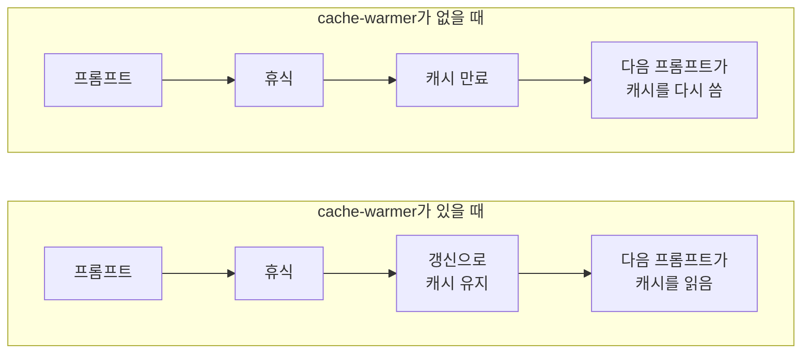
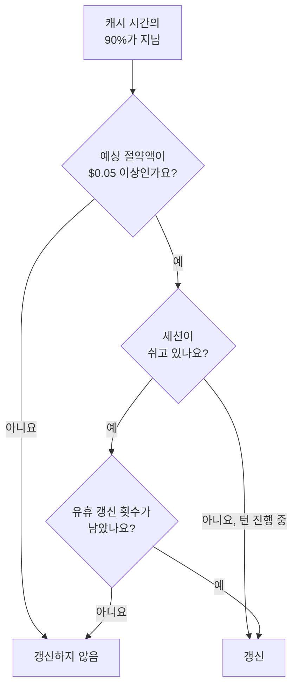

<div align="center">

<picture>
  <source media="(prefers-color-scheme: dark)" srcset="assets/clawd-dark.gif">
  
</picture>

# cache-warmer

**잠시 자리를 비워도 Claude Code의 프롬프트 캐시를 따뜻하게 유지해서, 다음 프롬프트 비용을 줄여 줘요.**

[블로그 글](https://blog.paulbkim.dev/cache-warmer/) · [웹사이트](https://paulbkim.dev) · [X](https://x.com/paulbkimdev)

[English](README.md) · 한국어 · [简体中文](README.zh-CN.md)

</div>

<br>

## 무슨 일을 하나요?

프롬프트를 보낼 때마다 대화 전체가 API로 가요.
API는 대화 앞부분을 5분이나 1시간 동안 **프롬프트 캐시**에 보관해요.
캐시를 읽는 프롬프트는 비용이 훨씬 적게 들고 응답도 더 빨리 시작해요.
캐시가 만료되면 다음 프롬프트가 캐시 전체를 더 비싼 가격에 다시 써요.

cache-warmer는 캐시가 만료되기 직전에 작은 **갱신** 요청을 하나 보내서 캐시를 따뜻하게 유지해요.
[Pi](https://github.com/earendil-works/pi)의 캐시 워머와 같은 방식이에요.



<br>

## 설치하기

```sh
claude plugin marketplace add paulbkim-dev/claude-code-cache-warmer
claude plugin install cache-warmer@claude-code-cache-warmer
```

Claude Code를 다시 시작한 뒤 `/cache-warmer`를 입력하면 패널이 열려요.
캐시 유지를 모두 멈추려면 `claude plugin disable cache-warmer`를 실행하세요.

<br>

## 화면에 보이는 것

갱신하는 동안 프롬프트 위에 띠가 나타나요. Claude Code 마스코트 Clawd 옆에 캐시된 프롬프트를 다시 보내고 있다는 알림이 떠요.
캐시 시간을 색으로 보여 주고(`5m` 청록, `1h` 자홍), 갱신 간격과 결과도 보여 줘요. 갱신 중에는 노랑, 캐시가 따뜻하면 초록, 만료되거나 실패하면 빨강이에요.
턴이 진행 중이면 띠는 갱신이 끝나고 5초 뒤에 사라져요.
세션이 쉬는 중이면 다음 프롬프트까지 남아 있고, 5초 뒤부터 Clawd는 움직이지 않아요.
패널 첫 화면에도 Clawd가 나타나요.

- 갱신 요청은 대화에 끼어들지 않아요. 대화 기록에는 갱신마다 ☕로 시작하는 알림 줄이 하나씩 남고, 이 줄은 어떤 요청에도 실려 모델로 가지 않아요.
- 띠는 세 가지 모양이 있고 Configuration 페이지나 `/config`의 `cache-warmer.band` 항목에서 골라요. `default`는 Clawd와 알림을, `simplified`는 알림 한 줄만 보여 주고, `off`는 띠를 숨겨요.
- 갱신 요청은 `[cache-warmer]`로 시작해서, 요청 로그나 프록시에서 내 프롬프트와 구별할 수 있어요.
- `reduceMotion`을 켜면 Clawd가 움직이지 않아요.
- `/cache-warmer preview`는 실제 갱신 없이 세 가지 상태를 미리 보여 줘요.

<br>

## 패널

`/cache-warmer`로 이 메뉴가 있는 패널을 열고 닫아요.

```text
Configuration           지금 세션 설정과 새 세션에 쓸 기본값
Analytics               비용과 절약액
Debug mode              켜기와 끄기
```

- 프롬프트 입력란이 비어 있을 때 열면 패널이 키보드 포커스를 받고 Configuration이 선택돼요.
- 열려 있지만 키보드 포커스가 없는 패널에서 `/cache-warmer`를 실행하면 포커스가 패널로 돌아가요. 포커스가 있는 패널에서 실행하면 패널이 닫혀요.
- Tab과 화살표 키로 항목 사이를 옮겨요. Enter로 페이지를 열거나 Debug mode를 켜고 꺼요. 각 페이지 맨 위에는 Back 버튼이 있고, `● 5m  ○ 1h` 같은 설정은 Enter로 다음 값으로 바꿔요.
- 패널에 포커스가 있거나, 진행 중인 턴이 없고 프롬프트 입력란이 비어 있으면 Escape로 패널을 닫아요.
- 메뉴 아래 한 줄에 다음 갱신 시각이나 캐시 유지가 멈춘 이유가 나와요.

<br>

## 캐시 시간

|  | 5분 | 1시간 |
|---|---|---|
| 갱신 시점 | 4분 30초 뒤 | 54분 뒤 |
| 캐시 쓰기 가격 | 입력 가격의 1.25배 | 입력 가격의 2배 |
| 쉬는 동안 따뜻하게 남는 시간(기본 한도) | 27분 30초 | 5시간 30분 |

- 기본값은 1시간이에요. Configuration 페이지의 Global 부분, `/config`의 `cache-warmer.ttl` 항목, 또는 `/cache-warmer 5m`, `/cache-warmer 1h` 명령어로 바꿔요. 명령어는 지금 세션도 함께 바꿔요.
- 세션에서 메인 대화의 첫 응답이 오면 캐시 시간이 잠겨요. `/clear`를 하거나 새 세션을 열면 잠금이 풀려요. 잠겨 있는 동안 명령어는 거부되고, 새 기본값은 다음 세션부터 적용돼요.
- 이 모드는 실행 중인 Claude Code 프로세스에 `CLAUDE_CODE_PROMPT_CACHE_TTL`을 설정해서 `promptCacheTtl`과 셸에서 온 값보다 우선해요. 바꾼 값은 다음 요청부터 적용되고, 그 요청이 캐시를 한 번 다시 써요.
- `FORCE_PROMPT_CACHING_5M=1`이면 캐시는 늘 5분이고, Configuration 페이지에도 그렇게 나와요.
- 갱신 한 번으로 두 캐시 시간이 모두 늘어나요. 2026-10-05에 한 실제 테스트에서 1시간 캐시를 60분 넘게 따뜻하게 유지했어요.
- 갱신이 프리픽스의 절반도 읽지 못하면 캐시가 만료된 것으로 보고 캐시 유지를 멈춰요.

<br>

## 언제 갱신하나요?



갱신은 캐시 시간의 90% 시점에 하고, Pi의 규칙을 통과해야 해요.

```text
만료 전에 다음 요청이 올 확률 × 프리픽스를 다시 쓰는 추가 비용 − 갱신 비용 ≥ $0.05
```

확률은 턴이 진행 중일 때 100%, 세션이 쉬고 있을 때 15%로 봐요.
그래서 모델마다 본전이 되는 프롬프트 크기가 있고, 그보다 작은 프롬프트는 갱신하지 않아요.
멈춘 이유에 두 크기가 모두 나와요.

세션이 쉬는 동안에는 마지막 프롬프트 뒤로 캐시 시간마다 **유휴 한도**만큼만 갱신해요.
한도는 0부터 20까지이고 기본값은 5예요. Configuration 페이지나 `cache-warmer.idle5m`, `cache-warmer.idle1h` 항목에서 정해요.
마지막 유휴 갱신을 쓰고 나면 띠가 캐시 유지가 멈췄다고 경고하고 캐시가 만료되는 시각을 다음 프롬프트까지 보여 줘요.
턴이 진행 중일 때는 마지막 프롬프트 뒤 60분, 또는 캐시 시간 두 번 중 더 긴 시간이 지나면 멈춰요.

대화 압축, `/clear`, 모델 변경, 실패했거나 캐시 만료를 확인한 갱신, 너무 늦게 울린 타이머 뒤에도 멈춰요.
다음 요청이 오면 다시 시작해요.

<br>

## Debug mode

디버그 모드가 켜져 있으면 메뉴 아래에 최근 갱신이 경과 시간, 결과, 토큰, 비용, 예상 절약액과 함께 나와요.
갱신과 멈춤마다 JSON 한 줄도 `<config>/cache-warmer/debug/<session id>.jsonl`에 덧붙여요. `<config>`는 `CLAUDE_CONFIG_DIR` 또는 `~/.claude`예요.

> ⚠️ 이 모드는 `/rewind`를 알아채지 못해요.
> 되감은 뒤에도 다음 요청이 오기 전까지는 되감기 전 대화의 프리픽스를 계속 따뜻하게 유지해요.

<br>

## 보내는 것과 저장하는 것

갱신 요청은 모드가 자동으로 보내요.
각 갱신은 메인 대화의 마지막 요청을 포크한 것이고, 같은 모델에 이 프롬프트를 담아 보내요.

> [cache-warmer] Automated prompt cache refresh by the cache-warmer plugin, not a message from the user. Reply with the single word ok.

| | |
|---|---|
| 보내는 것 | 갱신 요청뿐이에요. 다른 네트워크 요청이나 원격 측정(telemetry)은 없어요. |
| 요금 | 갱신마다 다른 요청과 똑같이 Claude 요금제나 API 키 사용량에 포함돼요. |
| 설정하는 것 | 실행 중인 Claude Code 프로세스의 `CLAUDE_CODE_PROMPT_CACHE_TTL` |
| 저장하는 것 | 플러그인 저장소의 전체 기간 합계, 대화 기록에 남는 갱신별 알림 줄, 디버그 모드가 켜져 있을 때의 디버그 로그 |
| 멈추는 법 | 유휴 한도를 둘 다 0으로 하면 유휴 갱신이 멈춰요. 플러그인을 끄면 모든 갱신이 멈춰요. |

<br>

## 출처

갱신 시점, $0.05 규칙, 유휴 한도라는 아이디어는 Mario Zechner가 만든 [Pi](https://github.com/earendil-works/pi)의 캐시 워머에서 가져왔어요.
cache-warmer는 이를 Claude Code 모드로 옮겼고, 30분이 지나면 멈추는 대신 유휴 갱신 횟수를 세요.
Pi의 코드는 복사하지 않았어요.

## 문의

문제는 [github.com/paulbkim-dev/claude-code-cache-warmer/issues](https://github.com/paulbkim-dev/claude-code-cache-warmer/issues)에 알려 주세요.
cache-warmer는 [MIT 라이선스](LICENSE)로 배포해요.
