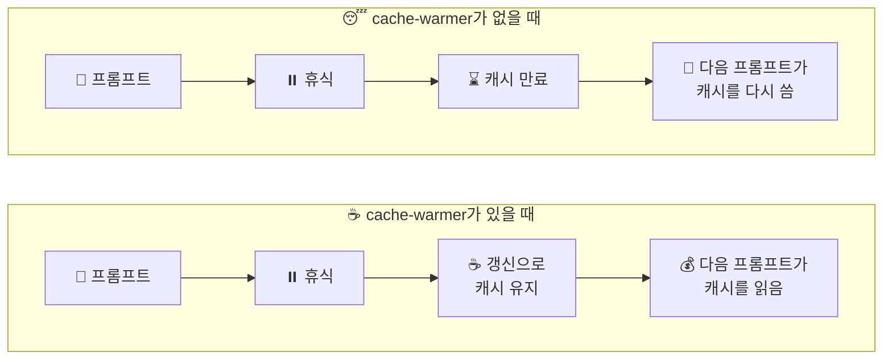
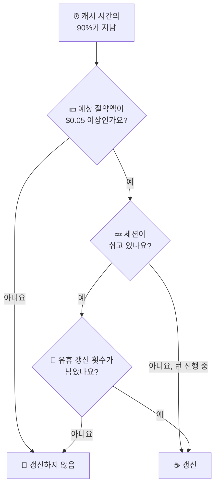
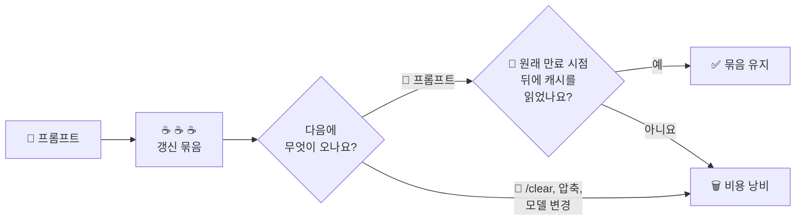

<div align="center">

<picture>
  <source media="(prefers-color-scheme: dark)" srcset="assets/clawd-dark.gif">
  
</picture>

# ☕ cache-warmer

**잠시 자리를 비워도 Claude Code의 프롬프트 캐시를 따뜻하게 유지해서, 다음 프롬프트 비용을 줄여 줘요.**

🇬🇧 [English](README.md) · 🇰🇷 한국어

</div>

<br>

## 🤔 무슨 일을 하나요?

프롬프트를 보낼 때마다 Claude Code는 대화 전체를 API로 보내요.
API는 대화 앞부분을 잠깐 동안 **프롬프트 캐시**에 보관해요. 보관 시간은 5분이나 1시간이에요.
캐시를 읽는 프롬프트는 비용이 훨씬 적게 들고 응답도 더 빨리 시작해요.
캐시가 만료되면 다음 프롬프트가 캐시 전체를 다시 써야 해서 비용이 더 들어요.

cache-warmer는 캐시가 만료되기 직전에 작은 **갱신** 요청을 하나 보내요.
갱신 요청이 캐시를 읽으면 API는 캐시 보관 시간을 처음부터 다시 세요.
[Pi](https://github.com/earendil-works/pi)의 캐시 워머와 같은 방식이에요.



<br>

## 🚀 설치하기

1. 마켓플레이스를 추가하고 모드를 설치하세요.

   ```sh
   claude plugin marketplace add paulbkim-dev/claude-code-cache-warmer
   claude plugin install cache-warmer@claude-code-cache-warmer
   ```

2. Claude Code를 다시 시작하세요.
3. `/cache-warmer`를 입력해서 패널을 여세요.

> 🛑 캐시 유지를 모두 멈추려면 플러그인을 끄세요: `claude plugin disable cache-warmer`

<br>

## 👀 화면에 보이는 것

갱신하는 동안 프롬프트 위 띠에 Claude Code 마스코트 Clawd가 나타나요.

| Clawd | 뜻 |
|---|---|
| ☕ 김이 나는 머그잔을 홀짝여요 | 갱신하고 있어요. |
| 💛 김으로 그린 하트 아래에서 깡충 뛰어요 | 캐시가 따뜻해요. |
| 😴 식은 머그잔 옆에서 졸아요 | 캐시가 만료됐거나 갱신에 실패했어요. |

- 갱신 요청은 대화에 끼어들지 않아요.
- 대화 기록에는 갱신마다 ☕로 시작하는 알림 줄이 하나씩 남아요. 이 줄은 어떤 요청에도 실려 모델로 가지 않아요.
- 띠를 보려면 빈 줄이 일곱 줄 있는 터미널이 필요해요. 그 밖의 환경에서는 결과 한 줄만 보여요.
- `reduceMotion`을 켜면 Clawd가 움직이지 않아요.
- `/cache-warmer preview`는 실제 갱신 없이 세 가지 상태를 미리 보여 줘요.

<br>

## 🧭 패널

`/cache-warmer`로 패널을 열고 닫아요. 패널은 이 메뉴로 열려요.

```text
/cache-warmer
├── 🌐 Global configuration    새 세션에 쓸 설정
├── 🗂️ Session configuration   지금 세션에만 쓸 설정
├── 📊 Analytics               비용과 절약액
└── 🐞 Debug mode              최근 갱신 목록
```

- ⌨️ Tab과 화살표 키로 항목 사이를 옮기고, Enter로 항목을 열어요.
- 🎯 패널이 키보드 입력을 받으면 첫 항목에 포커스가 가요.
- ↩️ 각 페이지 맨 위에는 메뉴로 돌아가는 Back 버튼이 있어요. 패널을 다시 열면 언제나 메뉴부터 보여요.
- ⎋ 패널에 키보드 포커스가 있거나, 진행 중인 턴이 없고 프롬프트 입력란이 비어 있으면 Escape로 패널을 닫아요.
- ⏰ 메뉴 아래 한 줄에는 다음 갱신 시각이나 캐시 유지가 멈춘 이유가 나와요.

### 🎨 Clawd와 테마

터미널 패널에 자리가 있으면 메뉴 왼쪽에 Clawd가 서 있어요.
알림이 떠 있으면 그 장면을 따라 하고, 캐시 유지가 켜져 있으면 머그잔을 홀짝이고, 멈추면 졸아요.

머그잔과 김의 색은 Claude Code 테마를 따라요.
밝은 테마에서는 밝은 배경에 맞춰 그려요.
`auto` 테마에서는 `COLORFGBG`가 밝은 배경을 가리킬 때도 똑같이 그려요.
`auto`일 때 Claude Code는 터미널에 배경색을 묻기도 하지만, 플러그인은 그 대답을 읽을 수 없어요.
그래서 `COLORFGBG`를 설정하지 않은 터미널에서는 어두운 색으로 그려요.

<br>

## ⚙️ 설정

| 페이지 | 바꾸는 것 |
|---|---|
| 🌐 Global configuration | 새 세션에 쓸 설정이에요. 플러그인의 `/config` 항목에 저장해요. |
| 🗂️ Session configuration | 지금 세션만 바꿔요. 저장된 기본값은 그대로예요. |

### 🌐 Global configuration

기본 캐시 시간은 세 가지 방법으로 정할 수 있어요.

- Global 페이지의 Default lifetime 버튼
- `/config`의 `cache-warmer.ttl` 항목
- `/cache-warmer 5m` 또는 `/cache-warmer 1h` 명령어

세션의 캐시 시간이 잠긴 뒤에도 페이지와 `/config`로 기본값을 저장할 수 있어요.
지금 세션은 캐시 시간이 잠기기 전까지만 바뀐 값을 따라가요.
명령어는 지금 세션도 함께 바꾸고, 캐시 시간이 잠겨 있으면 거부해요.

### 🗂️ Session configuration

이 페이지는 캐시 시간, 갱신 간격, 유휴 한도, 그리고 다음 갱신 시각이나 멈춘 이유를 보여 줘요.
`FORCE_PROMPT_CACHING_5M`이 설정되어 있으면 경고도 보여 줘요.

<br>

## ⏳ 캐시 시간

|  | 5분 | 1시간 |
|---|---|---|
| ⏰ 갱신 시점 | 4분 30초 뒤 | 54분 뒤 |
| ✍️ 캐시 쓰기 가격 | 입력 가격의 1.25배 | 입력 가격의 2배 |
| 💤 기본 유휴 한도로 캐시가 따뜻하게 남는 시간 | 27분 30초 | 5시간 30분 |

- 🔧 이 모드는 실행 중인 Claude Code 프로세스에 `CLAUDE_CODE_PROMPT_CACHE_TTL`을 설정해요. 이 값은 `promptCacheTtl` 설정과 셸에서 물려받은 값보다 우선해요.
- 🔁 바꾼 값은 다음 요청부터 적용돼요. 그 요청은 캐시를 한 번 다시 써요.
- 🔒 세션에서 메인 대화의 첫 응답이 오면 캐시 시간이 잠겨요. 그 뒤 Session 페이지는 버튼 없이 캐시 시간만 보여 줘요.
- 🔓 `/clear`를 하면 잠금이 풀려요. 새 세션은 잠기지 않은 상태로 시작해요.
- 📌 `FORCE_PROMPT_CACHING_5M=1`이면 무엇을 고르든 캐시는 5분이에요. Session 페이지에도 이렇게 나와요.
- ☕ 갱신 한 번으로 두 캐시 시간이 모두 늘어나요. 2026-10-05에 한 실제 테스트에서 기본 5분 서브에이전트 버킷으로 보낸 갱신이 1시간 캐시를 60분 넘게 유지했어요. 이 모드가 없는 세션은 같은 캐시를 다시 썼어요.
- ⚠️ 갱신이 프리픽스의 절반도 읽지 못하면, 캐시가 만료됐다고 알리고 캐시 유지를 멈춰요.

<br>

## 🧮 언제 갱신하나요?



갱신은 캐시 시간의 90% 시점에 해요. 5분 캐시는 4분 30초마다, 1시간 캐시는 54분마다예요.
그때 모드는 Pi의 규칙을 적용해요.

```text
만료 전에 다음 요청이 올 확률 × 프리픽스를 다시 쓰는 추가 비용 − 갱신 비용 ≥ $0.05
```

- 🎲 확률은 턴이 진행 중일 때 100%, 세션이 쉬고 있을 때 15%로 봐요.
- 📏 그래서 모델마다 본전이 되는 프롬프트 크기가 있어요. 토큰이 그보다 적은 프롬프트는 갱신하지 않아요. 멈춘 이유에는 진행 중인 턴과 쉬는 세션의 크기가 둘 다 나와요.
- 💲 이 크기는 모델 가격에 따라 달라요. 쉬는 세션은 진행 중인 턴보다 훨씬 큰 프롬프트가 있어야 갱신해요.
- ✅ 모드는 응답이 도착할 때, 갱신을 예약하기 전에 크기를 확인해요.

### 💤 유휴 한도

세션이 쉬는 동안 마지막 프롬프트 요청 뒤에 갱신할 수 있는 횟수는 캐시 시간마다 정해져 있어요.
이 횟수가 **유휴 한도**예요.

- Global 페이지에서 한도를 0부터 20까지 정할 수 있어요. 기본값은 5예요.
- `/config` 항목은 `cache-warmer.idle5m`과 `cache-warmer.idle1h`예요.
- 페이지는 한도 옆에 쉬는 캐시가 얼마나 오래 따뜻하게 남는지 보여 줘요. 한도 × 갱신 간격에 캐시 시간 한 번을 더한 값이에요.
- 유휴 갱신도 하나하나 $0.05 규칙을 통과해야 해요.

턴이 진행 중일 때는 마지막 프롬프트 요청 뒤 60분, 또는 캐시 시간 두 번 중 더 긴 시간이 지나면 캐시 유지를 멈춰요.

### 🛑 이럴 때도 멈춰요

- 대화 압축(compaction)
- `/clear`
- 모델 변경
- 실패했거나 캐시 만료를 확인한 갱신
- 너무 늦게 울린 타이머

다음 요청이 오면 캐시 유지를 다시 시작해요.

갱신 요청에는 출력 길이 제한이 없어요.
그래서 비용을 추정할 때 직전 갱신의 출력 토큰을 함께 넣어요.
Opus로 high effort에서 한 테스트에서는 갱신 한 번에 출력 토큰 182개를 썼어요.

<br>

## 📊 Analytics

Analytics 페이지는 지금 세션과 전체 기간을 나란히 보여 줘요.
전체 기간 합계는 플러그인 저장소에 남고, 페이지에 표시된 날짜부터 세요.
비용은 `hooks/warmer.ts`에 있는 API 정가로 계산한 추정치예요. 구독 요금과는 달라요.

| 항목 | 뜻 |
|---|---|
| 🔁 Refreshes | 보낸 갱신 횟수 |
| 💸 Warming fee | 갱신에 든 비용 |
| 🗑️ no prompt followed | 유지된 프롬프트가 뒤따르지 않은 갱신 묶음의 비용 |
| ✅ Prompts kept | 갱신이 없었다면 캐시가 만료됐을 시점 뒤에 캐시를 읽은 프롬프트 |
| ♻️ Rewrites avoided | 유지된 프롬프트마다: 읽은 캐시 토큰 × (쓰기 가격 − 읽기 가격) |
| 💰 Net saved | Rewrites avoided − Warming fee |

**갱신 묶음**은 두 프롬프트 요청 사이에 보낸 갱신들이에요.



아직 진행 중인 묶음은 유지로도 낭비로도 세지 않아요.

<br>

## 🐞 Debug mode

- 메뉴에서 Debug mode를 고르면 디버그 모드가 켜지고 그 페이지가 열려요. Turn off로 끌 수 있어요.
- 페이지에는 패널에 들어가는 만큼 최근 갱신이 나와요. 경과 시간, 결과, 읽고 쓴 토큰, 출력 토큰, 비용, 예상 절약액을 보여 줘요.
- 갱신은 캐시가 만료되기 전에 프롬프트가 와야만 비용을 아껴요.
- 디버그 모드가 켜져 있으면 갱신과 멈춤마다 JSON 한 줄을 `<config>/cache-warmer/debug/<session id>.jsonl`에 덧붙여요. `<config>`는 `CLAUDE_CONFIG_DIR` 또는 `~/.claude`예요.
- 갱신 줄에는 시각, 모델, 토큰 사용량, 비용, 절약액, 결과, 단계, 캐시 시간이 들어가요. 멈춤 줄에는 시각과 이유가 들어가요.
- 파일 쓰기에 실패하면 로그에 한 줄 남기고 캐시 유지는 계속해요.

> ⚠️ 이 모드는 `/rewind`를 알아채지 못해요.
> 되감은 뒤에도 다음 요청이 오기 전까지는 되감기 전 대화의 프리픽스를 계속 따뜻하게 유지해요.

<br>

## 🔐 보내는 것과 저장하는 것

갱신 요청은 모드가 자동으로 보내요.
각 갱신은 메인 대화의 마지막 요청을 포크한 것이고, 다른 요청과 똑같이 요금이 붙어요.
Claude Code는 대화에서 쓰는 모델에 이 프롬프트를 담아 보내요.

> Prompt cache refresh. Reply with the single word ok.

| | |
|---|---|
| 📤 보내는 것 | 갱신 요청뿐이에요. 다른 네트워크 요청이나 원격 측정(telemetry)은 없어요. |
| 💳 요금 | 갱신마다 다른 요청과 똑같이 Claude 요금제나 API 키 사용량에 포함돼요. |
| 🔧 설정하는 것 | 실행 중인 Claude Code 프로세스의 `CLAUDE_CODE_PROMPT_CACHE_TTL` |
| 💾 저장하는 것 | 플러그인 저장소의 전체 기간 합계, 대화 기록에 남는 갱신별 알림 줄, 디버그 모드가 켜져 있을 때만 쓰는 디버그 로그 |
| 🛑 멈추는 법 | 유휴 한도를 둘 다 0으로 하면 유휴 갱신이 멈춰요. 플러그인을 끄면 모든 갱신이 멈춰요. |

<br>

## 🙏 출처

갱신 시점, $0.05 규칙, 유휴 한도라는 아이디어는 Mario Zechner가 만든 [Pi](https://github.com/earendil-works/pi)의 캐시 워머에서 가져왔어요.
cache-warmer는 이를 Claude Code 모드로 옮겼고, 30분이 지나면 멈추는 대신 유휴 갱신 횟수를 세요.
Pi의 코드는 복사하지 않았어요.

## 💬 문의

문제는 [github.com/paulbkim-dev/claude-code-cache-warmer/issues](https://github.com/paulbkim-dev/claude-code-cache-warmer/issues)에 알려 주세요.
cache-warmer는 [MIT 라이선스](LICENSE)로 배포해요.
