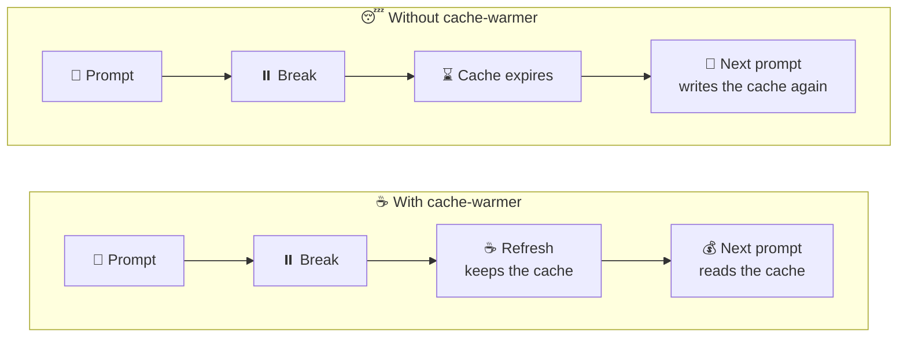
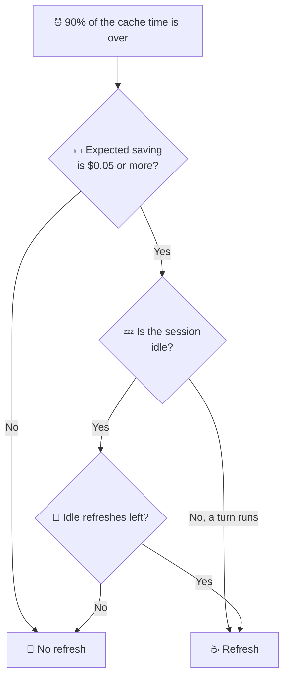
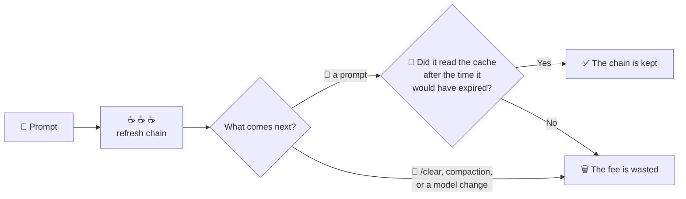

<div align="center">

<picture>
  <source media="(prefers-color-scheme: dark)" srcset="assets/clawd-dark.gif">
  
</picture>

# ☕ cache-warmer

**Keeps the Claude Code prompt cache warm during a break, so your next prompt costs less.**

English · [한국어](README.ko.md)

</div>

<br>

## 🤔 What does it do?

Each time you send a prompt, Claude Code sends the full conversation to the API.
The API keeps the start of the conversation in a **prompt cache** for a short time: 5 minutes or 1 hour.
A prompt that reads the cache costs much less and starts faster.
After the cache expires, the next prompt must write the full cache again, and this costs more.

cache-warmer sends one small **refresh** request shortly before the cache expires.
The refresh reads the cache, and the API starts the cache time again.
It works like the cache warmer in [Pi](https://github.com/earendil-works/pi).



<br>

## 🚀 Install

1. Add the marketplace and install the mod:

   ```sh
   claude plugin marketplace add paulbkim-dev/claude-code-cache-warmer
   claude plugin install cache-warmer@claude-code-cache-warmer
   ```

2. Restart Claude Code.
3. Type `/cache-warmer` to open the pane.

> 🛑 To stop all warming, disable the plugin: `claude plugin disable cache-warmer`

<br>

## 👀 What you see

During a refresh, a band above the prompt shows Clawd, the Claude Code mascot.

| Clawd | Meaning |
|---|---|
| ☕ Sips from a steaming mug | A refresh runs. |
| 💛 Hops under a heart of steam | The cache is warm. |
| 😴 Dozes with a cold mug | The cache expired, or the refresh failed. |

- The refresh never enters the conversation.
- The transcript keeps one notice row for each refresh, with ☕ at the start. No request sends this row to the model.
- The band needs a terminal with seven free rows. In other places, it shows only the result line.
- `reduceMotion` keeps Clawd still.
- `/cache-warmer preview` plays the three states with no refresh.

<br>

## 🧭 The pane

`/cache-warmer` opens and closes a pane. The pane opens on this menu:

```text
/cache-warmer
├── 🌐 Global configuration    settings for new sessions
├── 🗂️ Session configuration   settings for this session only
├── 📊 Analytics               costs and savings
└── 🐞 Debug mode              a list of recent refreshes
```

- ⌨️ Tab and the arrow keys move between items. Enter opens an item.
- 🎯 When the pane takes the keyboard, the first item has the focus.
- ↩️ Each page starts with a Back button, which goes back to the menu. The pane always opens again on the menu.
- ⎋ Escape closes the pane when the pane has keyboard focus, or when the prompt is idle and empty.
- ⏰ Below the menu, one line shows the time of the next refresh, or the reason why warming stopped.

### 🎨 Clawd and the theme

When the terminal pane has space, Clawd stands to the left of the menu.
Clawd plays the band's notice while one shows, sips while warming is on, and dozes after warming stops.

The mug and the steam follow the Claude Code theme.
A light theme draws them for a light background.
With the `auto` theme, a light background in `COLORFGBG` does the same.
Under `auto`, Claude Code also asks the terminal for its background, but plugins cannot read the answer.
Thus a terminal that does not set `COLORFGBG` gets the dark colors.

<br>

## ⚙️ Settings

| Page | What it changes |
|---|---|
| 🌐 Global configuration | The saved settings for new sessions, in the plugin's `/config` rows |
| 🗂️ Session configuration | Only the current session. The saved default does not change. |

### 🌐 Global configuration

You can set the default cache time in three ways:

- the Default lifetime buttons on the Global page
- the `/config` row `cache-warmer.ttl`
- the command `/cache-warmer 5m` or `/cache-warmer 1h`

The page and `/config` save the default also after the session's cache time is locked.
The current session follows the change only while its cache time is unlocked.
The command also sets the current session, and it refuses while the cache time is locked.

### 🗂️ Session configuration

This page shows the cache time, the refresh interval, the idle limit, and the next refresh or the stop reason.
It also shows a warning when `FORCE_PROMPT_CACHING_5M` is set.

<br>

## ⏳ Cache time

|  | 5 minutes | 1 hour |
|---|---|---|
| ⏰ Refresh after | 4m30s | 54m |
| ✍️ Cache write price | 1.25× the input price | 2× the input price |
| 💤 Warm time when idle, with the default idle limit | 27m30s | 5h30m |

- 🔧 The mod sets `CLAUDE_CODE_PROMPT_CACHE_TTL` for this Claude Code process. This value overrides the `promptCacheTtl` setting and any value from the shell.
- 🔁 A change applies from the next request. That request writes the cache again one time.
- 🔒 The first main-conversation response of a session locks the cache time. The Session page then shows it with no buttons.
- 🔓 `/clear` unlocks the cache time. A new session starts unlocked.
- 📌 `FORCE_PROMPT_CACHING_5M=1` keeps the cache at 5 minutes for all choices. The Session page shows this.
- ☕ A refresh extends both cache times. In a live test on 2026-10-05, a refresh in the default 5-minute subagent bucket kept a 1-hour cache warm past 60 minutes. A session without the mod wrote that cache again.
- ⚠️ If a refresh reads less than half of the prefix, the mod reports that the cache expired and stops warming.

<br>

## 🧮 When it refreshes



A refresh is due at 90% of the cache time: every 4m30s for 5 minutes, and every 54m for 1 hour.
At that time, the mod applies the rule from Pi:

```text
chance of another request before expiry × extra cost to write the prefix again − refresh cost ≥ $0.05
```

- 🎲 The chance is 100% while a turn runs, and 15% while the session is idle.
- 📏 Thus each model has a break-even prompt size. A prompt with fewer tokens gets no refresh. The stop reason shows the size for a running turn and for an idle session.
- 💲 The size depends on the model price. An idle cache needs a much larger prompt than a running turn.
- ✅ The mod checks the size when a response arrives, before it queues a refresh.

### 💤 Idle limit

While the session is idle, each cache time gets a maximum number of refreshes after the last prompt request.
This number is the **idle limit**.

- The Global page sets each limit from 0 to 20. The default is 5.
- The `/config` rows are `cache-warmer.idle5m` and `cache-warmer.idle1h`.
- Beside each limit, the page shows how long an idle cache stays warm: the limit × the refresh interval, plus one cache time.
- Each idle refresh must also pass the $0.05 rule.

While a turn runs, warming stops 60 minutes after the last prompt request, or after two cache times if that is longer.

### 🛑 Warming also stops after

- compaction
- `/clear`
- a model change
- a refresh that failed or found the cache expired
- a timer that fired too late

The next request starts warming again.

A refresh has no output limit.
Thus the cost estimate includes the output tokens of the previous refresh.
In one test, an Opus refresh at high effort used 182 output tokens.

<br>

## 📊 Analytics

The Analytics page shows this session and all time, side by side.
The all-time totals stay in the plugin store, from the date that the page shows.
Costs are estimates at the API list prices in `hooks/warmer.ts`. They are not subscription charges.

| Row | Meaning |
|---|---|
| 🔁 Refreshes | The number of refreshes sent |
| 💸 Warming fee | The cost of these refreshes |
| 🗑️ no prompt followed | The fees of refresh chains that no kept prompt followed |
| ✅ Prompts kept | Prompts that read the cache after the time when it would have expired with no refreshes |
| ♻️ Rewrites avoided | For each kept prompt: the cached tokens it read × (write price − read price) |
| 💰 Net saved | Rewrites avoided − warming fee |

A **refresh chain** is the refreshes between two prompt requests.



A chain that still runs counts as neither kept nor wasted.

<br>

## 🐞 Debug mode

- The Debug mode menu item turns debug mode on and opens its page. Turn off stops it.
- The page lists the newest refreshes that fit the pane: age, result, tokens read and written, output tokens, cost, and estimated saving.
- A refresh saves money only when a prompt comes before the cache expires.
- While debug mode is on, the mod adds one JSON line for each refresh and each stop to `<config>/cache-warmer/debug/<session id>.jsonl`. `<config>` is `CLAUDE_CONFIG_DIR` or `~/.claude`.
- A refresh line has its time, model, token use, cost, saving, result, phase, and cache time. A stop line has its time and reason.
- If a write fails, the mod reports it in a log line, and warming continues.

> ⚠️ The mod cannot see `/rewind`.
> After a rewind, refreshes keep the later prefix warm until the next request.

<br>

## 🔐 What it sends and stores

The mod sends each refresh automatically.
Each refresh is a fork of the last request of the main conversation, and you pay for it like any request.
Claude Code sends it to the model that the conversation uses, with this prompt:

> Prompt cache refresh. Reply with the single word ok.

| | |
|---|---|
| 📤 Sends | Only the refresh requests. No other network requests and no telemetry. |
| 💳 Bills | Each refresh counts against your Claude plan or API key, like all other requests. |
| 🔧 Sets | `CLAUDE_CODE_PROMPT_CACHE_TTL` for the running Claude Code process |
| 💾 Stores | The all-time totals in the plugin store, one notice row for each refresh in the transcript, and the debug log only while debug mode is on |
| 🛑 Stops | Set both idle limits to 0 to stop idle refreshes. Disable the plugin to stop all refreshes. |

<br>

## 🙏 Credits

The refresh timing, the $0.05 rule, and the idea of an idle limit come from the cache warmer in [Pi](https://github.com/earendil-works/pi) by Mario Zechner.
cache-warmer ports them to a Claude Code mod and counts idle refreshes instead of stopping at 30 minutes.
It copies no Pi code.

## 💬 Support

Report problems at [github.com/paulbkim-dev/claude-code-cache-warmer/issues](https://github.com/paulbkim-dev/claude-code-cache-warmer/issues).
cache-warmer is released under the [MIT License](LICENSE).
