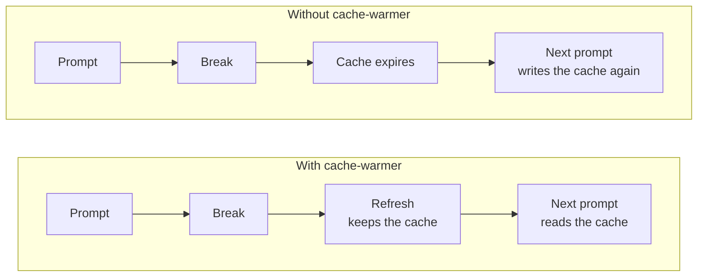
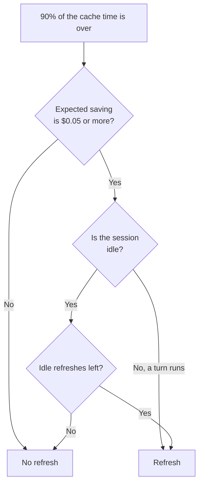

<div align="center">

<picture>
  <source media="(prefers-color-scheme: dark)" srcset="assets/clawd-dark.gif">
  
</picture>

# cache-warmer

**Keeps the Claude Code prompt cache warm during a break, so your next prompt costs less.**

[Blog post](https://blog.paulbkim.dev/cache-warmer/) · [Website](https://paulbkim.dev) · [X](https://x.com/paulbkimdev)

English · [한국어](README.ko.md) · [简体中文](README.zh-CN.md)

</div>

<br>

## What does it do?

Each prompt sends the full conversation to the API.
The API keeps the start of the conversation in a **prompt cache** for 5 minutes or 1 hour.
A prompt that reads the cache costs much less and starts faster.
After the cache expires, the next prompt writes the full cache again at a higher price.

cache-warmer sends one small **refresh** shortly before the cache expires, so the cache stays warm.
It works like the cache warmer in [Pi](https://github.com/earendil-works/pi).



<br>

## Install

```sh
claude plugin marketplace add paulbkim-dev/claude-code-cache-warmer
claude plugin install cache-warmer@claude-code-cache-warmer
```

Restart Claude Code, then type `/cache-warmer` to open the pane.
To stop all warming, run `claude plugin disable cache-warmer`.

<br>

## What you see

During a refresh, a band above the prompt shows Clawd, the Claude Code mascot, beside a notice that the mod is resending the cached prompt.
It shows the cache time in color (`5m` cyan, `1h` magenta), the refresh interval, and the outcome: yellow while the refresh runs, green when the cache is warm, and red when it expired or failed.
During a turn, the band goes 5 seconds after the refresh.
In an idle session it stays until your next prompt, with Clawd still after 5 seconds.
The pane's main page shows Clawd too.

- The refresh never enters the conversation. The transcript keeps one notice row per refresh, starting with ☕, and no request sends it to the model.
- The band has three styles, set on the Configuration page or in the `/config` row `cache-warmer.band`: `default` shows Clawd beside the notice, `simplified` shows the notice as one line, and `off` hides the band.
- Each refresh request starts with `[cache-warmer]`, so a request log or proxy can tell it from your prompts.
- `reduceMotion` keeps Clawd still.
- `/cache-warmer preview` plays the three states with no refresh.

<br>

## The pane

`/cache-warmer` opens and closes a pane with this menu:

```text
Configuration           this session, then defaults for new sessions
Analytics               costs and savings
Debug mode              on or off
```

- The pane takes the keyboard when it opens over an empty prompt, with Configuration selected.
- `/cache-warmer` on an open pane without the keyboard gives the keyboard back to it; on a pane with the keyboard, it closes the pane.
- Tab and the arrow keys move between items. Enter opens a page or turns Debug mode on or off. Each page starts with a Back button, and Enter on a setting such as `● 5m  ○ 1h` moves it to the next option.
- Escape closes the pane when the pane has focus, or when the prompt is idle and empty.
- A line below the menu shows the next refresh, or why warming stopped.

<br>

## Cache time

|  | 5 minutes | 1 hour |
|---|---|---|
| Refresh after | 4m30s | 54m |
| Cache write price | 1.25× input | 2× input |
| Warm time when idle, default limit | 27m30s | 5h30m |

- Set the default under New sessions on the Configuration page, in the `/config` row `cache-warmer.ttl`, or with `/cache-warmer 5m` or `/cache-warmer 1h`. The command also sets the current session.
- The first main-conversation response locks the session's cache time. `/clear` or a new session unlocks it. While it is locked, the command refuses, and a new default applies to later sessions only.
- The mod sets `CLAUDE_CODE_PROMPT_CACHE_TTL` for this Claude Code process, so it overrides `promptCacheTtl` and the shell. A change applies from the next request, which writes the cache once.
- `FORCE_PROMPT_CACHING_5M=1` keeps the cache at 5 minutes, and the Configuration page says so.
- A refresh extends both cache times. In a live test on 2026-10-05, it kept a 1-hour cache warm past 60 minutes.
- A refresh that reads less than half of the prefix counts as expired and stops warming.

<br>

## When it refreshes



A refresh is due at 90% of the cache time, and it must pass the rule from Pi:

```text
chance of another request before expiry × extra cost to write the prefix again − refresh cost ≥ $0.05
```

The chance is 100% while a turn runs and 15% while the session is idle.
So each model has a break-even prompt size, and a smaller prompt gets no refresh.
The stop reason shows both sizes.

While the session is idle, each cache time gets at most its **idle limit** of refreshes after the last prompt.
The limit is 0 to 20, 5 by default, set on the Configuration page or in `cache-warmer.idle5m` and `cache-warmer.idle1h`.
When the last idle refresh is used, the band warns that warming stopped and shows when the cache expires, until your next prompt.
While a turn runs, warming stops 60 minutes after the last prompt, or after two cache times if that is longer.

Warming also stops after compaction, `/clear`, a model change, a failed or expired refresh, or a timer that fired too late.
The next request starts it again.

<br>

## Debug mode

While debug mode is on, the newest refreshes show under the menu with their age, result, tokens, cost, and estimated saving.
The mod also appends one JSON line per refresh and per stop to `<config>/cache-warmer/debug/<session id>.jsonl`, where `<config>` is `CLAUDE_CONFIG_DIR` or `~/.claude`.

> ⚠️ The mod cannot see `/rewind`.
> After a rewind, refreshes keep the later prefix warm until the next request.

<br>

## What it sends and stores

The mod sends each refresh automatically.
Each refresh is a fork of the main conversation's last request, sent to the same model with this prompt:

> [cache-warmer] Automated prompt cache refresh by the cache-warmer plugin, not a message from the user. Reply with the single word ok.

| | |
|---|---|
| Sends | Only the refresh requests. No other network requests and no telemetry. |
| Bills | Each refresh counts against your Claude plan or API key, like any request. |
| Sets | `CLAUDE_CODE_PROMPT_CACHE_TTL` for the running Claude Code process |
| Stores | All-time totals in the plugin store, one notice row per refresh in the transcript, and the debug log while debug mode is on |
| Stops | Set both idle limits to 0 to stop idle refreshes. Disable the plugin to stop all refreshes. |

<br>

## Credits

The refresh timing, the $0.05 rule, and the idea of an idle limit come from the cache warmer in [Pi](https://github.com/earendil-works/pi) by Mario Zechner.
cache-warmer ports them to a Claude Code mod and counts idle refreshes instead of stopping at 30 minutes.
It copies no Pi code.

## Support

Report problems at [github.com/paulbkim-dev/claude-code-cache-warmer/issues](https://github.com/paulbkim-dev/claude-code-cache-warmer/issues).
cache-warmer is released under the [MIT License](LICENSE).
