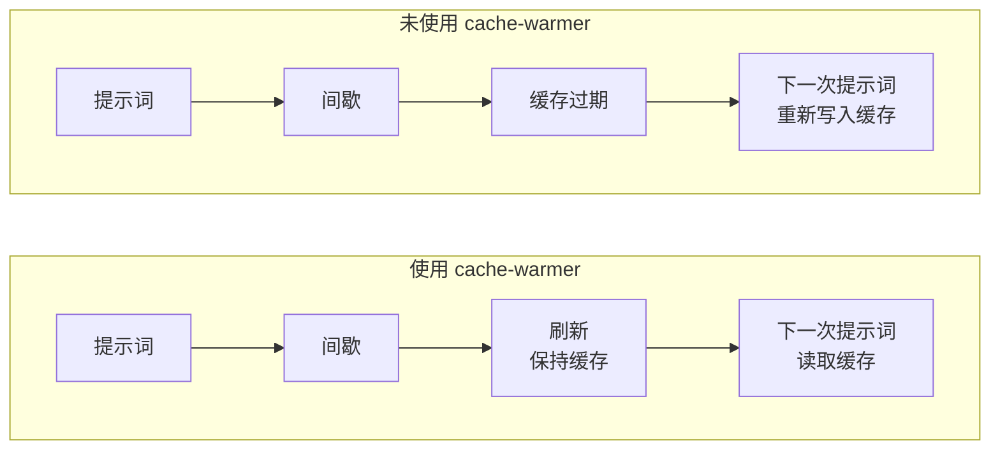
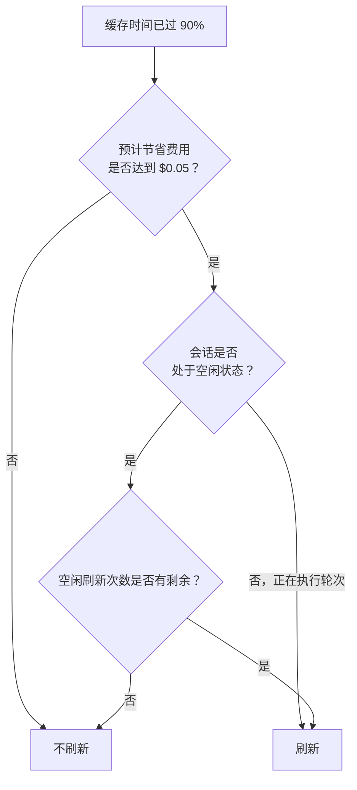

<div align="center">

<picture>
  <source media="(prefers-color-scheme: dark)" srcset="assets/clawd-dark.gif">
  
</picture>

# cache-warmer

**在思考间歇保持 Claude Code 提示词缓存预热，降低下一次提示词的成本。**

[博客文章](https://blog.paulbkim.dev/cache-warmer/) · [个人网站](https://paulbkim.dev) · [X](https://x.com/paulbkimdev)

[English](README.md) · [한국어](README.ko.md) · 简体中文

</div>

<br>

## 功能介绍

每次发送提示词时，都会将完整会话发送给 API。
API 会将对话开头部分保存在**提示词缓存**中，保留 5 分钟或 1 小时。
读取缓存的提示词费用要低得多，响应速度也更快。
缓存过期后，下一次提示词将以更高的写入价格重新写入完整缓存。

cache-warmer 会在缓存即将过期前发送一次极小的**刷新**请求，让缓存持续保持预热状态。
它的工作机制类似于 [Pi](https://github.com/earendil-works/pi) 中的缓存预热功能。



<br>

## 安装

```sh
claude plugin marketplace add paulbkim-dev/claude-code-cache-warmer
claude plugin install cache-warmer@claude-code-cache-warmer
```

重启 Claude Code，然后输入 `/cache-warmer` 打开面板。
若要完全停止预热，请运行 `claude plugin disable cache-warmer`。

<br>

## 界面显示

在刷新期间，提示词上方会显示一条提示栏，展示 Claude Code 吉祥物 Clawd 以及插件正在重新发送缓存提示词的通知。
它以彩色显示缓存时间（`5m` 为青色，`1h` 为品红）、刷新间隔以及结果状态：刷新进行中为黄色，缓存保持预热为绿色，过期或失败为红色。
在轮次进行中，提示栏会在刷新结束 5 秒后消失。
在空闲会话中，提示栏会一直保留到你发送下一个提示词，Clawd 则会在 5 秒后静止。
面板的主页面同样会显示 Clawd。

- 刷新请求绝不会混入对话中。会话记录中每次刷新仅保留一行以 ☕ 开头的通知，且绝不会作为请求内容发送给模型。
- 提示栏提供三种样式，可在 Configuration 页面或 `/config` 的 `cache-warmer.band` 配置项中设置：`default` 显示 Clawd 及通知，`simplified` 以单行显示通知，`off` 则隐藏提示栏。
- 每次刷新请求均以 `[cache-warmer]` 开头，便于在请求日志或代理中将其与你的提示词区分开来。
- `reduceMotion` 可让 Clawd 保持静止。
- `/cache-warmer preview` 可在不触发实际刷新的情况下演示这三种状态。

<br>

## 面板

使用 `/cache-warmer` 可以打开或关闭包含以下菜单的面板：

```text
Configuration           当前会话设置，以及新会话的默认值
Analytics               费用与节省金额
Debug mode              开启或关闭
```

- 当在空白提示词处打开面板时，面板会自动获取键盘焦点，并默认选中 Configuration。
- 面板已打开但未获得键盘焦点时，运行 `/cache-warmer` 可将焦点交还给面板；若面板已拥有焦点，再次运行则会关闭面板。
- 使用 Tab 和方向键在各菜单项之间切换。按 Enter 打开页面或切换 Debug mode 开关。每个页面顶部均包含一个 Back 按钮，在类似 `● 5m  ○ 1h` 的设置项上按 Enter 可切换到下一个选项。
- 当面板拥有焦点，或者提示词处于空闲且输入框为空时，按 Escape 即可关闭面板。
- 菜单下方的一行文字会显示下一次刷新时间，或显示预热停止的原因。

<br>

## 缓存时间

|  | 5 分钟 | 1 小时 |
|---|---|---|
| 刷新触发时机 | 4m30s | 54m |
| 缓存写入价格 | 1.25× 输入价格 | 2× 输入价格 |
| 空闲保持预热时长（默认上限） | 27m30s | 5h30m |

- 可在 Configuration 页面的 New sessions 下设置默认值，也可通过 `/config` 中的 `cache-warmer.ttl` 配置项，或使用 `/cache-warmer 5m` / `/cache-warmer 1h` 命令进行设置。该命令同时也会修改当前会话。
- 主会话生成首次回复后，该会话的缓存时间即被锁定。执行 `/clear` 或开启新会话可解除锁定。锁定期间命令将拒绝修改，此时设置的新默认值仅适用于后续新会话。
- 插件会为当前运行的 Claude Code 进程设置 `CLAUDE_CODE_PROMPT_CACHE_TTL`，因此其优先级高于 `promptCacheTtl` 及 Shell 环境变量。修改将在下一次请求时生效，该请求会重新写入一次缓存。
- 若设置了 `FORCE_PROMPT_CACHING_5M=1`，缓存将固定为 5 分钟，Configuration 页面也会显示相应提示。
- 每次刷新都会延长这两种缓存时间的有效期。在 2026-10-05 的实测中，它成功将 1 小时的缓存预热状态保持超过了 60 分钟。
- 如果一次刷新读取的前缀不足一半，将被视作缓存已过期并停止预热。

<br>

## 刷新时机



当缓存时间过去 90% 时即触发刷新，且必须满足来自 Pi 的判定规则：

```text
过期前产生下一次请求的概率 × 重新写入前缀的额外成本 − 刷新成本 ≥ $0.05
```

在轮次进行中该概率为 100%，而会话处于空闲时该概率为 15%。
因此每个模型都存在一个收支平衡的提示词大小门槛，低于该大小的提示词不会触发刷新。
停止原因中会同时显示这两个阈值大小。

会话处于空闲状态时，在最后一条提示词发出后，每种缓存时间最多仅刷新其**空闲上限**（idle limit）设定的次数。
上限范围为 0 到 20，默认为 5，可在 Configuration 页面或通过 `cache-warmer.idle5m` 和 `cache-warmer.idle1h` 进行配置。
当最后一次空闲刷新用完时，提示栏会警告预热已停止并显示缓存过期时间，直到你发送下一个提示词。
在轮次进行中，预热将在最后一条提示词发出 60 分钟后停止；若两个缓存周期更长，则在两个缓存周期后停止。

此外，在上下文压缩（compaction）、`/clear`、切换模型、刷新失败或检测到过期、或者定时器触发严重超时后，预热也会停止。
下一次请求发出时将重新开始预热。

<br>

## Debug mode

当开启 Debug mode 时，菜单下方会显示最近的刷新记录，包括其距今时间、结果、Token 数、费用以及预计节省金额。
插件还会将每次刷新和每次停止的记录以单行 JSON 追加到 `<config>/cache-warmer/debug/<session id>.jsonl`，其中 `<config>` 为 `CLAUDE_CONFIG_DIR` 或 `~/.claude`。

> ⚠️ 插件无法感知 `/rewind` 操作。
> 回退之后，在下一次请求发出之前，刷新仍会保持回退前较长前缀的预热状态。

<br>

## 发送与存储的内容

插件会自动发送每次刷新请求。
每次刷新均是从主会话的最后一次请求派生（fork）而来，并使用以下提示词发送给相同的模型：

> [cache-warmer] Automated prompt cache refresh by the cache-warmer plugin, not a message from the user. Reply with the single word ok.

| | |
|---|---|
| 发送内容 | 仅发送刷新请求。无其他网络请求，亦无遥测数据（telemetry）。 |
| 计费方式 | 与常规请求一样，每次刷新均计入你的 Claude 套餐配额或 API Key 账单。 |
| 设置项 | 为运行中的 Claude Code 进程设置 `CLAUDE_CODE_PROMPT_CACHE_TTL` |
| 存储内容 | 插件存储中的历史累计总量、会话记录中每次刷新保留的一行通知，以及开启 Debug mode 时的调试日志 |
| 停止方式 | 将两项空闲上限均设为 0 可停止空闲刷新。禁用插件可停止所有刷新。 |

<br>

## 致谢

刷新时机、$0.05 规则以及空闲上限的设计均源自 Mario Zechner 开发的 [Pi](https://github.com/earendil-works/pi) 中的缓存预热机制。
cache-warmer 将这些特性移植为 Claude Code 插件，并采用统计空闲刷新次数的方式，而非简单地在 30 分钟后停止。
本项目未复制任何 Pi 的代码。

## 支持与反馈

如遇问题，请在 [github.com/paulbkim-dev/claude-code-cache-warmer/issues](https://github.com/paulbkim-dev/claude-code-cache-warmer/issues) 提交反馈。
cache-warmer 基于 [MIT License](LICENSE) 开源发布。
